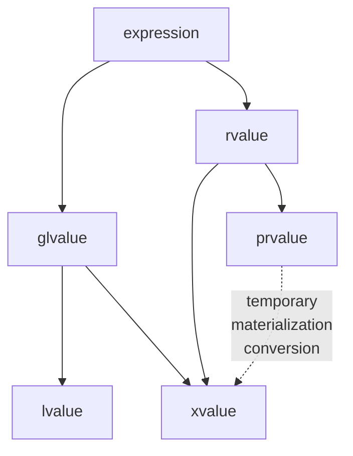

### A Trivial Class

```cpp
class Customer {
    std::string name;
public:
    Customer(const std::string &n): name(n) { assert(n.size() > 0); }
    void setName(const std::string &n) { assert(n.size() > 0); name = n; }
    std::string &getName() { return name; }
    const std::string &getName() const { return name; }
};

std::ostream &operator<<(std::ostream &os, const Customer &c) {
    return os << c.getName();
}
```

>You should be skeptical, it sounds too easy for C++, how could something be simple in C++

#### Using direct list init

```cpp
    Customer(const std::string &n): name{n} { assert(n.size() > 0); }
```

#### move semantic

```cpp
    Customer(std::string n): name{std::move(n)} { assert(name.size() > 0); }
    void setName(std::string n) { assert(n.size() > 0); name = std::move(n); } // herb sutter might disagree
```

#### getters

Remove `std::string &getName()`

Howerver,

```cpp
Customer foo();

for (char c : foo().getName()) {
    std::cout << c;  // run-time ERROR
}
```

Because references extend lifetime of returned temporaries,

```cpp
auto &tmp1 = foo();             // does extend lifetime of return value
auto &tmp2 = tmp1.getName();    // OK
std::cout << tmp2 << '\n';      // OK
```

but not of indirectly referenced temporaries,

```cpp
auto &tmp = foo().getName();    // does NOT extend lifetime of return value of foo()
std::cout << tmp << '\n';       // ERROR
```

Range-based `for` loop
```cpp
auto&& _rg = foo().getName();   // does NOT extend lifetime of return value of foo()
for (auto _pos=_rg.begin(), _end=_rg.end(); _pos!=_end; ++_pos) {
    char c = *_pos;
    cout << c;
}
```

Don't return references to members of temporaries (prvalue)

```cpp
    std::string getName() && { return name; }
    const std::string &getName() const & { return name; }
```

#### Hidden friends

[hidden friends](https://www.justsoftwaresolutions.co.uk/cplusplus/hidden-friends.html)

>If you have an operation that is inside a class, then it will not be used if not one of the arguemnt has your type

By rule, only considered if Customer (or derived type) is involved

```cpp
#include <string>

struct BigInt {
    BigInt(std::string) {};
};

BigInt operator*(BigInt, BigInt) {
    return {"hi"};
}

int main() {
    std::string{"hello"} * std::string{"world"};    // OK
                                                    // ERROR if make operator* a BigInt friend
}
```

Thus, `operator<<` should be a hidden friend

```cpp
class Customer {
    std::string name;
public:
    Customer(std::string n) : name{std::move(n)} { assert(name.size() > 0); }
    void setName(std::string n) { assert(n.size() > 0); name = std::move(n); }
    std::string getName() && { return name; }
    const std::string &getName() const & { return name; }

    friend std::ostream &operator<<(std::ostream &os, const Customer &c) {
        return os << c.getName();
    }
};
```

#### Fundation programmer style

```cpp
class Customer {
    std::string name;
public:
    Customer(const std::string &n) : name{n} {}
    Customer(std::string &&n) : name{std::move(n)} {}
    Customer(const char *n) : name{n} {}
    void setName(const std::string &n) { name = n; }
    void setName(std::string &&n) { name = std::move(n); }
    void setName(const char *n) { name = n; }
    ;;;
};
```

#### What get us here

1. A project that started ~50 years ago
2. Constantly evolving
3. Backward compatibility is key
  - API & ABI
4. Community driven
  - of experts

## Value Categories

**K&R C**

```cpp
int i;
i = 42;     // OK
42 = i;     // ERROR
```

`i` is lvalue, OK on *left-hand side* of an assignment

`42` is rvalue, only *right-hand side* of an assignment

Can take the address of an lvalue, but not an rvalue

```cpp
int *p = &i;    // OK for lvalue only
int *q = &42;   // ERROR
```

**ANSI C**

```cpp
const int c = 0;
c = 42;             // ERROR => no lvalue
const int *r = &c;  // OK    => lvalue
```

Now `c` cannot be on the left side, but can be taken address

So `c` is lvalue: *localizable* value

rvalue: *read-only* value ("roughly")

**C++11**

```cpp
std::string s;
std::move(s) = "hello";     // OK    => lvalue
auto sp = &std::move(s);    // ERROR => no lvalue
```

So the decision is, `std::move()` is xvalue, a bit like lvalue, a bit like rvalue, most of rvalue rules apply to xvalue. Then rename original rvalue to prvalue, and let rvalue represent both



- LValue: Localizable value, (everything that has a *name* and *string literals*):
  - Variable, data member, function, string literal, returned lvalue reference
  - Can be on the left side of an assignment only if it's modifiable
- PRValue: Pure RValue (former RValue), (*temporaries* and *other literals*):
  - All literals except string literals (`42`, `true`, `nullptr`, ...), `this`, lambda, returned non-reference, result of constructor call (`T(...)`)
- XValue: eXpiring value, (value from `std::move()`):
  - Returned rvalue reference (e.g. by `std::move()`), cast to rvalue reference

**C++17**

- prvalue perform *initialization*
  - No temporary object yet
- glvalue produce locations
- Materialization as a temporary object:
  - prvalue-to-xvalue conversion

### Type versus Value Category

```cpp
void passRValueRef(std::string &&s); // can only pass rvalues, and s is not const

std::string s;          // s is lvalue
passRValueRef(s);       // ERROR: cannot bind lvalue to rvalue reference
const std::string &cs;  // cs is lvalue
passRValueRef(cs);       // ERROR: cannot bind lvalue to rvalue reference
passRValueRef("hello"); // OK (string literal (lvalue) converted to std::string (prvalue))
passRValueRef(std::string{"hello"});    // OK (can pass prvalue)
passRValueRef(std::move(s));            // OK (can pass xvalue)

void passRValueRef(std::string &&s) { // s has type std::string &&, value category lvalue
    passRValueRef(s);   // ERROR: cannot bind lvalue to rvalue reference
    passRValueRef(std::move(s));    // OK (can pass xvalue)
    // but std::move is a cast, casts s back to its own type: static_cast<std::string &&>(s)
}
```

```cpp
template <typename T>
void passRValueRef(T&& s);  // universal reference/forwarding reference, s can be const

std::string s;          // s is lvalue
passRValueRef(s);       // OK
const std::string cs;   // cs is lvalue
passRValueRef(cs);      // OK
```

```cpp
template <typename T>
void passRValueRef(typename T::iterator &&);    // follows first rule, it is not forwarding reference

std::string::iterator pos1;     // s is lvalue
passRValueRef(pos1);            // ???
const std::string::iterator pos2;   // cs is lvalue
passRValueRef(pos2);            // ???
```

Rejected syntax for universal references

```cpp
template <typename T>
void passRValueRef(T&&& s);
// Overloading syntax with different sematics is cool for experts, a nightmare for application programmers, but who cares
```

### When Scott and Herb Give Different Advice

Herb's style, *no claim* to move, *guarantee* to move

```cpp
void sink(std::unique_ptr<MyType> up);  // sink() gets ownership in up

std::unique_ptr<MyType> up(new MyType);

sink(std::move(up));    // up loses ownership
sink(up);               // ERROR: because copying of type of up is deleted
```

Scott's style, *claim* to possibly move, *no guarantee* to move

```cpp
void sink(std::unique_ptr<MyType>&& up);    // up refers to passed argument

std::unique_ptr<MyType> up(new MyType);

sink(std::move(up));    // up might lose ownership
sink(up);               // ERROR: due to declaration of sink()
```

Herb more agree to Scott's style

### Contradicting Style Guides: Core Guidelines

```
ES.23: Prefer the {} initializer syntax

- Reason
  * The rules for {} initialization are simplier, more general, less ambilguous, and safer than for other forms of initialization.

- Note
  * Old habits die hard, so this rule is hard to apply consistently, especially as there are so many cases where = is innocent
```

```
https://abseil.io/tips/88#best-practices-for-initialization

- Direct uniform initialzation has two shortcomings;
  1. "uniform" is a stretch: there are cases where ambiguity still exists (for the casual reader, not the compiler) in what is being called and how
  2. this syntax is not exactly intuitive: no other common language uses something like it

- The important question is: how much should we change our habits and language understanding to take advantage of that change?
- For uniform initilization syntax, we don't believe in general that the benefits outweight the drawbacks

- Use assignment syntax when
  * intializing directly
    - with the intended literal value (for example: int, float, or std::string values),
    - with smart pointers such as std::shared_ptr, std::unique_ptr,
    - with containers (std::vector, std::map, etc)
  * when performing struct initialization, or
  * doing copy construction
- Use the tradtional constructor syntax (with parentheses) when the initialization is performing some active logic, rather than simply composing values together
- Use {} initialization without the = only if the above option don't compile
- Never mix {}s and auto
```

>When standardize templates, we didn't know which beast we created. When standardize namespace, we didn't know which nightmare we created with ADL. When we standardized move semantics, we didn't know what the new style is to write just simple classes.
