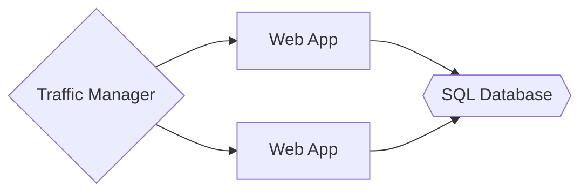

# Web-queue-worker Style



* Use the built-in autoscale feature of APP Service to scale out the number of VM instances.

## Failures

* Detect failures
* Respond to failures gracefully
* Log and monitor failures, to give operational insight

1. Build retry logic into your application to handle transient failure. For **many** Azure services, the client SDK implements automatic retries.
2. Use the *Curcuit Breaker pattern* to fail fast when an operation is likely to fail
3. Partition a system into isolated groups, so that a failure in one partition does not bring down the entire system
4. If an instance can't be reached, fail over to another instance
5. Provide reduced functionality that is still useful
6. Throttle users create excessive load for a centain period of time. If a client exceeds a defined limit, the web API can return a response message with status 503 (Servcie Unavialable) and include a Retry-After header that specifies when the client can send the next request without it being declined
7. Block clients consistently exceeds their quota or otherwise behave badly

## Make all things redundant

1. Don't use a single VM for mission-critical workloads. Instead, place multiple VMs behind a load balancer
2. Azure SQL Database *automatically* replicate the data within a region, and geo-replication across regions can be enabled.
3. If the Azure Traffic Manager service fails, change CNAME records in the DNS to point to the other traffic management service.

## Design to scale out

1. Tasks that require a lot of CPU or I/O resources should be moved to *background jobs* when possible

## Database Partitioning

* In horizontal partitioning (sharding). For example, customers whose name start with A-M go into one partition, N-Z into another partition.
* In vertical partitioning. For example, put frequently accessed fields in one partition, and less frequently accessed fields in another
* In functional partitioning. For exmaple, store invoice data in one partition and product inventory data in another.

## Choose a candidate service


App Servcie. A managed service for hosting web apps, mobile app back ends, RESTful APIs, or automated business processes

### App Service hosting model

* Application Composition: Applications, containers
* Density: Multiple apps per instance via app service plans
* Minimum number of nodes: 1
* state managment: stateless
* Web hosting: Built in
* Can be deployed to dedicated VNet: Requires App Service Environment (ASE)
* Hybrid connectivity: Use Azure App Service Hybrid Connections

### App Service DevOps

* Local debugging: IIS Express, others
* Programming Model: Web and API applications, WebJobs for background tasks
* Application update: Deployment slots

### App Service Scalability

* Autoscaling: Built-in service
* Load balancer: Integrated
* Scale limit: 20 instances, 100 with App Service Environment (ASE)

### APP Service Availability

* SLA: Azure guarantee the Apps running in a customer subscription will be available 99.95% of the time. **No SLA** is provided for APPs under either the Free or Shared tiers
* Multi region failover: Traffic manager

## Choose a load balancing service

| Service             | Global/regional | Recommanded traffic |
|---------------------|-----------------|---------------------|
| Azure Front Door    | Global          | HTTP(S)             |
| Traffic Manager     | Global          | non-HTTP(S)         |
| Application Gateway | Regional        | HTTP(S)             |
| Azure Load Balancer | Regioinal       | non-HTTP(S)         |

* **HTTP(S)** load-balancing service are Layer 7 load balancers that only accept HTTP(S) traffic. They are intended for web applications or other HTTP(S) endpoints.

* **Non-HTTP(S)** load-balancing services can handle non-HTTP(S) traffic and are recommanded for non-web workloads


SLA for Application Gateway: 99.95%

SLA for Traffic Manager: 99.99%

SLA for Load Balancer: 99.99%

SLA for Basic Load Balancer: N/A

The Application Gateway is nothing but an Azure Load Balancer with the addional features on the layer 7 of the OSI model. The additional features:

1. HTTP load-balancing (CDN?)
2. SSL termination
3. Cookie based seesion affinity
4. Web Application Firewall

If using Traffic Manager alone does not meet your business requirements for HA, consider adding another traffic management solution as a failback. If the Azure Traffic Manager service fails, change your CNAME records in DNS to point to the other traffic management service

* Application that are publicly accesible from the internet. As a best practice, web application firewall and DDos protection should be setup

## Best practice

### Keep_Alive

HTTP1.0 added the Connection:Keep-Alive header that enables a client application to indicate to the server that is can use the same connection to send subsequent requests rather than opening new ones. This behavior is the default in HTTP 1.1 as used by Azure.

However, it can be detrimental to scalability by keeping unnecessary connections open for longer than required, limiting the ability of other concurrent clients to connect. It can also affect battery life if the client is running on a mobile device.

To ensure that a connection is not made persistent with HTTP 1.1, the client can include a Connection:Close header to override the default behavior. Similary, the server can include a Connection:Close header in response

### RESTful API

| Resource            | POST                              | GET                                 | PUT                                           | DELETE                           |
|---------------------|-----------------------------------|-------------------------------------|-----------------------------------------------|----------------------------------|
| /customers          | Create a new customer             | Retrieve all customers              | Bulk update of customers                      | Remove all customers             |
| /customers/1        | Error                             | Retrieve the details for customer 1 | Update the details of customer 1 if it exists | Remove customer 1                |
| /customers/1/orders | Create a new order for customer 1 | Retrieve all orders for customer 1  | Bulk update of orders for customer 1          | Remove all orders for customer 1 |

GET, PUT, DELETE, HEAD, and PATCH actions should be idempotent

### Comfront to HTTP sematics

#### Media types

POST example

```http
POST https://adventure-works.com/orders HTTP/1.1
Content-Type: application/json; charset=utf-8
Content-Length: 57

{"Id":1,"Name":"Gizmo","Category":"Widgets","Price":1.99}
```

If the server doesn't support the media type, it should return HTTP status code 415 (Unsupported Media Type)

GET example

```http
GET https://adventure-works.com/orders/2 HTTP/1.1
Accept: application/json
```

If the server cannot match any of the media type(s) listed, it should return HTTP status code 406 (Not Accepted)

#### GET

* A successful GET method typically returns HTTP status code 200 (OK)
* If the resource cannot be found, the method should return 404 (Not Found)
* If the server cannot match any of the media type(s) listed, it should return HTTP status code 406 (Not Accepted)

#### POST

* If a POST method creates a new resource, it returns HTTP status code 201 (Created)
  * The URI of the new resource is included in the Location header of the response
  * The response body contains a representation of the resource
* If the method does some processing but does not create a new resource, the method can return status code 200
  * The response body contains the result of the operation
  * If there is no result to return, HTTP status code 204 (No Content) should be used with no response body
* If the client puts invalid data into the request, the server should return HTTP status code 400 (Bad Request)
  * The respone body can contain additional information about the error or a link to a URI that provides more details
* If the server doesn't support the media type, it should return HTTP status code 415 (Unsupported Media Type)

#### PUT

* If a PUT method creates a new resource, it returns HTTP status code 201 (Created)
* If the method updates an existing resource, it returns either 200 (OK) or 204 (No Content).
* If it might not be possible to update an existing resource, consider returning HTTP status code 409 (Confilict).

Consider to implementing bulk HTTP PUT operations that can batch updates to multiple resource in a collection. The PUT request should specify the URI of the collection, and the request body should specify the details of the resource to be modified.

#### PATCH

There are two patch method: JSON merge patch and JSON patch

Original resource:

```json
{
    "name":"gizmo",
    "category":"widgets",
    "color":"blue",
    "price":10
}
```

JSON merge patch:

```json
{
    "price":12,
    "color":null,
    "size":"small"
}
```

This tells the server to update `price`, delete `color`, and add `size`, while `name` and `category` are not modified. The media type for JSON merge path is `application/merge-patch+json`

Merge patch is not suitable if the original resource can contain explicit null values. The order that server should apply the updates is not specified

The media type for JSON patch is `application/json-patch+json`

| Error condition                                                                                   | HTTP status code             |
|---------------------------------------------------------------------------------------------------|------------------------------|
| The patch document format isn't supported                                                         | 415 (Unsupported Media Type) |
| Malformed path document                                                                           | 400 (Bad Request)            |
| The patch document is valid, but the change can't be applied to the resource in its current state | 409 (Conflict)               |

#### DELETE

* If the delete operation is successful, the web server should respond with HTTP status code 204 (No Content)
  * The response body contains no further information
* If the resource doesn't exist, the web server can return HTTP 404 (Not Found)

#### Asynchronous operations

POST, PUT, PATCH, or DELETE might require processing that takes a while to complete. Consider making the oepration asynchronous, return HTTP status code 202 (Accepted) to indicate the request was accepted for processing but is not completed.

You should expose an endpoint that returns the status of an asynchronous request, so the client can monitor the status by polling the status point. Include the URI of the status endpoint in the Location header of the 202 response:

```http
HTTP/1.1 202 Accepted
Location: /api/status/12345
```

If the client sends a GET to this endpoint, the request should contain the current status of the request. Optionally, it could also include an estimated time to completion or a link to cancel the operation

```http
HTTP/1.1 200 OK
Content-Type: application/json

{
    "status":"In progress",
    "link": { "rel":"cancel", "method":"delete", "href":"/api/status/12345" }
}
```

If the asynchronous operation creates a new resource, the status endpoint should return status code 303 (See Other) after the operation completes. In the 303 response, include a Location header that gives the URI of the new resource:

```http
HTTP/1.1 303 See Other
Location: /api/orders/12345
```

#### Media type versioning

```http
GET https://adventure-works.com/customers/3 HTTP/1.1
Accept: application/vnd.adventure-works.v1+json
```

The web server confirms the format of the data in the response body by using the Content-Type header

```http
HTTP/1.1 200 OK
Content-Type: application/vnd.adventure-works.v1+json; charset=utf-8

{"id":3,"name":"Contoso LLC","address":"1 Microsoft Way Redmond WA 98053"}
```

### Autoscaling

* Vertical scaling, also called scaling up and down
* Horizontal scaling, also called scaling out and in

### Retry guidance

| Service                                 | Retry capabilities | Policy configuration | Scope                |
|-----------------------------------------|--------------------|----------------------|----------------------|
| SQL Database with Entity Framework Core | Native in client   | Programmatic         | Global per AppDomain |

```csharp
protected override void OnConfiguring(DbContextOptionsBuilder optionsBuilder)
{
    optionsBuilder
        .UseSqlServer(
            @"Server=(localdb)\mssqllocaldb;Database=EFMiscellanous.ConnectionResiliency;Trusted_Connection=True;",
            options => options.EnableRetryOnFailure());
}
```

The following code shows how to execute a transaction with automatic retries, by using an execution strategy. The transaction is defined in delegate. If a transient failure occurs, the execution strategy will invoke the delegate again.

```csharp
using (var db = new BloggingContext())
{
    var strategy = db.Database.CreateExecutionStrategy();

    strategy.Execute(() =>
    {
        using (var transaction = db.Database.BeginTransaction())
        {
            db.Blogs.Add(new Blog { Url = "https://blogs.msdn.com/dotnet" });
            db.SaveChanges();

            db.Blogs.Add(new Blog { Url = "https://blogs.msdn.com/visualstudio" });
            db.SaveChanges();

            transaction.Commit();
        }
    });
}
```

The following HTTP codes typically indicate that a retry is appropriate:

* 408 Request Timeout
* 429 Too Many Requests
* 500 Internal Server Error
* 502 Bad Gateway
* 503 Service Unavailable
* 504 Gateway Timeout

#### Retry stategies

**Immediate retry**. There should never be more than one immediate retry attempt, and you should switch to alternative strategies, such as exponential back-off or fallback actions, if the immediate retry fails

As a general guidline, use an exponential back-off strategy for background operations, and immediate or regular interval retry strategies for interative operations.

----

Azure

1. [subscription limits and quotas](https://docs.microsoft.com/en-us/azure/azure-resource-manager/management/azure-subscription-service-limits#azure-database-for-mysql)

Implementations

1. [API implementation](https://docs.microsoft.com/en-us/azure/architecture/best-practices/api-implementation)
2. [Polly: Transit falut handling](http://thepollyproject.org/)
