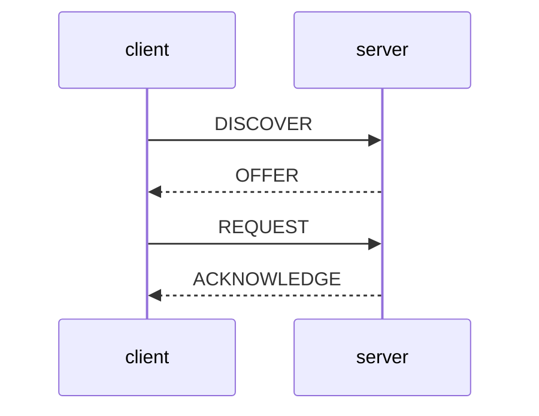

## DORA


1. DISCOVER: Client connects to the network and sends out a broadcast discovery looking for its DHCP information.
2. OFFER: The server offers the DHCP information to the client
3. REQUEST: The client requests verification of the DHCP information
4. ACK: The server acknowledges the DHCP request

Sometimes you will not see the DISCOVER / OFFER and just see the REQUEST / ACK. This heppens when the client has already obtained a valid DHCP lease earlier and is just requesting to have it again before its lease time expires. Typically this is performed when half the lease has lapsed.

If the REQUEST is not valid anymore the server will send a NACK indicating to the client that it can no longer use this DHCP information. This should cause the client to start over with a DISCOVER.

Sometimes you will see repeated DISCOVER / OFFER but never a REQUEST from the client. This happens when the client either doesn’t receive the OFFER or doesn’t like it for some reason. Perhaps a firewall is blocking it, they have a poor connection, or simply they’re using a Windows computer.

```
PL-3:/storage/no-backup/ipworks/logs/PL-3 # ip netns exec ipw_sig_sp-SE_fe01_e tcpdump -SXXnnvvvtttt port 67
PL-3:/storage/no-backup/ipworks/logs/PL-3 # tcpdump -i ipw_sig_sp -SXXnnvvvtttt port 67
tcpdump: listening on ipw_sig_sp, link-type LINUX_SLL (Linux cooked), capture size 262144 bytes
2020-01-01 15:26:27.173559 IP (tos 0x0, ttl 56, id 64549, offset 0, flags [DF], proto UDP (17), length 344)
    10.198.27.4.67 > 10.228.18.1.67: [udp sum ok] BOOTP/DHCP, Request from 0a:16:36:fb:bb:4a, length 316, hops 1, xid 0xa000001, Flags [Broadcast] (0x8000)
	  Gateway-IP 10.198.27.4
	  Client-Ethernet-Address 0a:16:36:fb:bb:4a
	  Vendor-rfc1048 Extensions
	    Magic Cookie 0x63825363
	    DHCP-Message Option 53, length 1: Discover
	    Vendor-Class Option 60, length 14: "EricssonVendor"
	    Parameter-Request Option 55, length 11: 
	      Subnet-Mask, Domain-Name, Default-Gateway, Domain-Name-Server
	      Netbios-Name-Server, Netbios-Node, Netbios-Scope, Router-Discovery
	      Static-Route, Vendor-Option, Option 252
	    Client-ID Option 61, length 7: ether 0a:16:36:fb:bb:4a
	    Hostname Option 12, length 24: "HostClient11090528025418"
	    Lease-Time Option 51, length 4: 1
	    Agent-Information Option 82, length 0
	    END Option 255, length 0
	0x0000:  0004 0301 0000 0000 0000 0000 0000 0800  ................
	0x0010:  4500 0158 fc25 4000 3811 02c1 0ac6 1b04  E..X.%@.8.......
	0x0020:  0ae4 1201 0043 0043 0144 25a6 0101 0601  .....C.C.D%.....
	0x0030:  0a00 0001 0000 8000 0000 0000 0000 0000  ................
	0x0040:  0000 0000 0ac6 1b04 0a16 36fb bb4a 0000  ..........6..J..
	0x0050:  0000 0000 0000 0000 0000 0000 0000 0000  ................
	0x0060:  0000 0000 0000 0000 0000 0000 0000 0000  ................
	0x0070:  0000 0000 0000 0000 0000 0000 0000 0000  ................
	0x0080:  0000 0000 0000 0000 0000 0000 0000 0000  ................
	0x0090:  0000 0000 0000 0000 0000 0000 0000 0000  ................
	0x00a0:  0000 0000 0000 0000 0000 0000 0000 0000  ................
	0x00b0:  0000 0000 0000 0000 0000 0000 0000 0000  ................
	0x00c0:  0000 0000 0000 0000 0000 0000 0000 0000  ................
	0x00d0:  0000 0000 0000 0000 0000 0000 0000 0000  ................
	0x00e0:  0000 0000 0000 0000 0000 0000 0000 0000  ................
	0x00f0:  0000 0000 0000 0000 0000 0000 0000 0000  ................
	0x0100:  0000 0000 0000 0000 0000 0000 0000 0000  ................
	0x0110:  0000 0000 0000 0000 6382 5363 3501 013c  ........c.Sc5..<
	0x0120:  0e45 7269 6373 736f 6e56 656e 646f 7237  .EricssonVendor7
	0x0130:  0b01 0f03 062c 2e2f 1f21 2bfc 3d07 010a  .....,./.!+.=...
	0x0140:  1636 fbbb 4a0c 1848 6f73 7443 6c69 656e  .6..J..HostClien
	0x0150:  7431 3130 3930 3532 3830 3235 3431 3833  t110905280254183
	0x0160:  0400 0000 0152 00ff                      .....R..
2020-01-01 15:26:27.174894 IP (tos 0x0, ttl 63, id 58752, offset 0, flags [DF], proto UDP (17), length 328)
    10.228.18.1.67 > 10.198.27.4.67: [udp sum ok] BOOTP/DHCP, Reply, length 300, hops 1, xid 0xa000001, Flags [Broadcast] (0x8000)
	  Your-IP 10.198.27.8
	  Server-IP 10.228.18.1
	  Gateway-IP 10.198.27.4
	  Client-Ethernet-Address 0a:16:36:fb:bb:4a
	  Vendor-rfc1048 Extensions
	    Magic Cookie 0x63825363
	    DHCP-Message Option 53, length 1: Offer
	    Server-ID Option 54, length 4: 10.228.18.1
	    Lease-Time Option 51, length 4: 300
	    RN Option 58, length 4: 150
	    RB Option 59, length 4: 262
	    Subnet-Mask Option 1, length 4: 255.255.0.0
	    END Option 255, length 0
	    PAD Option 0, length 0, occurs 26
	0x0000:  0000 0301 0000 0000 0000 0000 0000 0800  ................
	0x0010:  4500 0148 e580 4000 3f11 1276 0ae4 1201  E..H..@.?..v....
	0x0020:  0ac6 1b04 0043 0043 0134 1290 0201 0601  .....C.C.4......
	0x0030:  0a00 0001 0000 8000 0000 0000 0ac6 1b08  ................
	0x0040:  0ae4 1201 0ac6 1b04 0a16 36fb bb4a 0000  ..........6..J..
	0x0050:  0000 0000 0000 0000 0000 0000 0000 0000  ................
	0x0060:  0000 0000 0000 0000 0000 0000 0000 0000  ................
	0x0070:  0000 0000 0000 0000 0000 0000 0000 0000  ................
	0x0080:  0000 0000 0000 0000 0000 0000 0000 0000  ................
	0x0090:  0000 0000 0000 0000 0000 0000 0000 0000  ................
	0x00a0:  0000 0000 0000 0000 0000 0000 0000 0000  ................
	0x00b0:  0000 0000 0000 0000 0000 0000 0000 0000  ................
	0x00c0:  0000 0000 0000 0000 0000 0000 0000 0000  ................
	0x00d0:  0000 0000 0000 0000 0000 0000 0000 0000  ................
	0x00e0:  0000 0000 0000 0000 0000 0000 0000 0000  ................
	0x00f0:  0000 0000 0000 0000 0000 0000 0000 0000  ................
	0x0100:  0000 0000 0000 0000 0000 0000 0000 0000  ................
	0x0110:  0000 0000 0000 0000 6382 5363 3501 0236  ........c.Sc5..6
	0x0120:  040a e412 0133 0400 0001 2c3a 0400 0000  .....3....,:....
	0x0130:  963b 0400 0001 0601 04ff ff00 00ff 0000  .;..............
	0x0140:  0000 0000 0000 0000 0000 0000 0000 0000  ................
	0x0150:  0000 0000 0000 0000                      ........
2020-01-01 15:26:27.673439 IP (tos 0x0, ttl 56, id 64605, offset 0, flags [DF], proto UDP (17), length 356)
    10.198.27.4.67 > 10.228.18.1.67: [udp sum ok] BOOTP/DHCP, Request from 0a:16:36:fb:bb:4a, length 328, hops 1, xid 0xa000002, Flags [none] (0x0000)
	  Gateway-IP 10.198.27.4
	  Client-Ethernet-Address 0a:16:36:fb:bb:4a
	  Vendor-rfc1048 Extensions
	    Magic Cookie 0x63825363
	    DHCP-Message Option 53, length 1: Request
	    Vendor-Class Option 60, length 14: "EricssonVendor"
	    Parameter-Request Option 55, length 11: 
	      Subnet-Mask, Domain-Name, Default-Gateway, Domain-Name-Server
	      Netbios-Name-Server, Netbios-Node, Netbios-Scope, Router-Discovery
	      Static-Route, Vendor-Option, Option 252
	    Client-ID Option 61, length 7: ether 0a:16:36:fb:bb:4a
	    Requested-IP Option 50, length 4: 10.198.27.8
	    Server-ID Option 54, length 4: 10.228.18.1
	    Hostname Option 12, length 24: "HostClient11090528025418"
	    Lease-Time Option 51, length 4: 1
	    Agent-Information Option 82, length 0
	    END Option 255, length 0
	0x0000:  0004 0301 0000 0000 0000 0000 0000 0800  ................
	0x0010:  4500 0164 fc5d 4000 3811 027d 0ac6 1b04  E..d.]@.8..}....
	0x0020:  0ae4 1201 0043 0043 0150 e7e2 0101 0601  .....C.C.P......
	0x0030:  0a00 0002 0000 0000 0000 0000 0000 0000  ................
	0x0040:  0000 0000 0ac6 1b04 0a16 36fb bb4a 0000  ..........6..J..
	0x0050:  0000 0000 0000 0000 0000 0000 0000 0000  ................
	0x0060:  0000 0000 0000 0000 0000 0000 0000 0000  ................
	0x0070:  0000 0000 0000 0000 0000 0000 0000 0000  ................
	0x0080:  0000 0000 0000 0000 0000 0000 0000 0000  ................
	0x0090:  0000 0000 0000 0000 0000 0000 0000 0000  ................
	0x00a0:  0000 0000 0000 0000 0000 0000 0000 0000  ................
	0x00b0:  0000 0000 0000 0000 0000 0000 0000 0000  ................
	0x00c0:  0000 0000 0000 0000 0000 0000 0000 0000  ................
	0x00d0:  0000 0000 0000 0000 0000 0000 0000 0000  ................
	0x00e0:  0000 0000 0000 0000 0000 0000 0000 0000  ................
	0x00f0:  0000 0000 0000 0000 0000 0000 0000 0000  ................
	0x0100:  0000 0000 0000 0000 0000 0000 0000 0000  ................
	0x0110:  0000 0000 0000 0000 6382 5363 3501 033c  ........c.Sc5..<
	0x0120:  0e45 7269 6373 736f 6e56 656e 646f 7237  .EricssonVendor7
	0x0130:  0b01 0f03 062c 2e2f 1f21 2bfc 3d07 010a  .....,./.!+.=...
	0x0140:  1636 fbbb 4a32 040a c61b 0836 040a e412  .6..J2.....6....
	0x0150:  010c 1848 6f73 7443 6c69 656e 7431 3130  ...HostClient110
	0x0160:  3930 3532 3830 3235 3431 3833 0400 0000  905280254183....
	0x0170:  0152 00ff                                .R..
2020-01-01 15:26:27.674465 IP (tos 0x0, ttl 63, id 58851, offset 0, flags [DF], proto UDP (17), length 328)
    10.228.18.1.67 > 10.198.27.4.67: [udp sum ok] BOOTP/DHCP, Reply, length 300, hops 1, xid 0xa000002, Flags [none] (0x0000)
	  Your-IP 10.198.27.8
	  Server-IP 10.228.18.1
	  Gateway-IP 10.198.27.4
	  Client-Ethernet-Address 0a:16:36:fb:bb:4a
	  Vendor-rfc1048 Extensions
	    Magic Cookie 0x63825363
	    DHCP-Message Option 53, length 1: ACK
	    Server-ID Option 54, length 4: 10.228.18.1
	    Lease-Time Option 51, length 4: 300
	    RN Option 58, length 4: 150
	    RB Option 59, length 4: 262
	    Subnet-Mask Option 1, length 4: 255.255.0.0
	    END Option 255, length 0
	    PAD Option 0, length 0, occurs 26
	0x0000:  0000 0301 0000 0000 0000 0000 0000 0800  ................
	0x0010:  4500 0148 e5e3 4000 3f11 1213 0ae4 1201  E..H..@.?.......
	0x0020:  0ac6 1b04 0043 0043 0134 8f8f 0201 0601  .....C.C.4......
	0x0030:  0a00 0002 0000 0000 0000 0000 0ac6 1b08  ................
	0x0040:  0ae4 1201 0ac6 1b04 0a16 36fb bb4a 0000  ..........6..J..
	0x0050:  0000 0000 0000 0000 0000 0000 0000 0000  ................
	0x0060:  0000 0000 0000 0000 0000 0000 0000 0000  ................
	0x0070:  0000 0000 0000 0000 0000 0000 0000 0000  ................
	0x0080:  0000 0000 0000 0000 0000 0000 0000 0000  ................
	0x0090:  0000 0000 0000 0000 0000 0000 0000 0000  ................
	0x00a0:  0000 0000 0000 0000 0000 0000 0000 0000  ................
	0x00b0:  0000 0000 0000 0000 0000 0000 0000 0000  ................
	0x00c0:  0000 0000 0000 0000 0000 0000 0000 0000  ................
	0x00d0:  0000 0000 0000 0000 0000 0000 0000 0000  ................
	0x00e0:  0000 0000 0000 0000 0000 0000 0000 0000  ................
	0x00f0:  0000 0000 0000 0000 0000 0000 0000 0000  ................
	0x0100:  0000 0000 0000 0000 0000 0000 0000 0000  ................
	0x0110:  0000 0000 0000 0000 6382 5363 3501 0536  ........c.Sc5..6
	0x0120:  040a e412 0133 0400 0001 2c3a 0400 0000  .....3....,:....
	0x0130:  963b 0400 0001 0601 04ff ff00 00ff 0000  .;..............
	0x0140:  0000 0000 0000 0000 0000 0000 0000 0000  ................
	0x0150:  0000 0000 0000 0000                      ........
```
